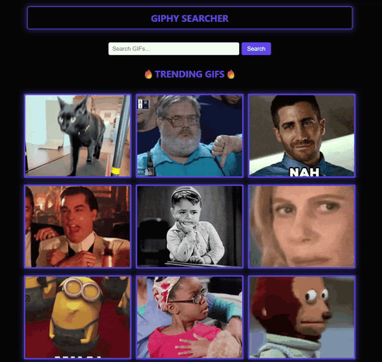
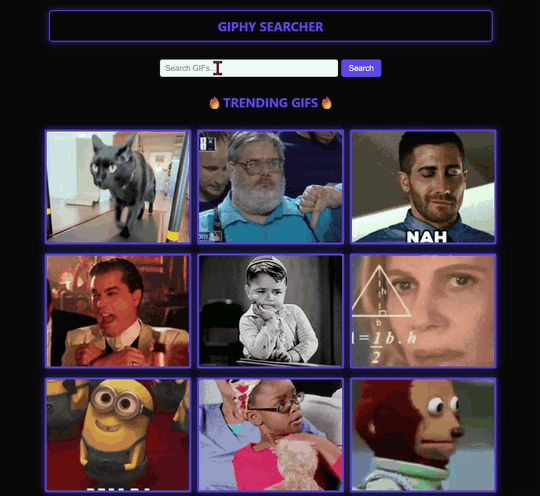

# Giphy App

A responsive React app that lets you browse trending GIFs and search for any topic using the Giphy API.

🔗 **Live demo:** [your-deployed-url.netlify.app](https://...)





## How to Use

When the app loads, you'll see trending GIFs — type a term and press Enter (or click Search) to find GIFs on any topic. Use "Load More" to see additional results, or "Back to Trending" to reset.

## Features

- Shows trending GIFs when the app loads
- Search for GIFs by keyword
- Displays 25 GIFs at a time
- "Load More" button fetches the next 25 results (using the API's `limit` and `offset`)
- Resets pagination when switching between trending and search
- Handles empty search results and failed API requests with a clear message
- Mobile-friendly layout

## Built With

- React
- Giphy API
- CSS

## Getting Started

1. Clone the repo
```
git clone https://github.com/audreyclarkdev/Giphy-App.git
```
2. Install dependencies
```
npm install
```
3. Set up your API key

Create a `.env` file in the root of the project and add your Giphy API key:
```
VITE_GIPHY_KEY=your_api_key_here
```
You can get a free API key by creating an app at [developers.giphy.com](https://developers.giphy.com).

4. Start the app
```
npm run dev
```

## What I Learned

Through this project I learned how to use shared state to render the GIFs, switch between trending and search modes, and use an offset to load more GIFs onto the page. Pagination was one of the trickiest parts for me. Once I understood that `offset` tracks where you are in the results, the replace-versus-append logic followed: searching fresh should wipe out the old results, but "Load More" should add to them. Getting that backwards means either the search never clears or the new GIFs overwrite the ones already on screen. My biggest challenge, though, was actually planning out what I was tackling. I originally had AI start coding the project for me, but I didn't understand the output — and I couldn't build on top of code I didn't understand. So I scrapped it and started fresh, with a rough idea of how to structure the project based on what I'd seen the AI do.